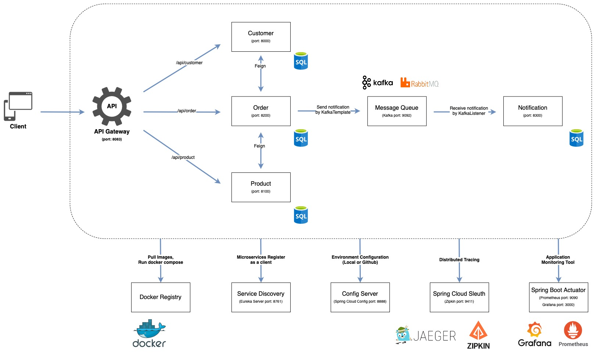

# Microservices with Spring Boot



## **Index**
* [Quick Start](#quick-start)
* [Config Server](#config-server)
* [Service Discovery](#service-discovery)
* [API Gateway](#api-gateway)
* [Resilience4j](#resilience4j)
* [Message Queue](#message-queue)
* [Spring Boot Actuator](#spring-boot-actuator-application-monitoring)
* [Spring Cloud Sleuth](#spring-cloud-sleuth-distributed-tracing)
* [Docker](#docker)
* [Kubernetes](#kubernetes)

## **Quick Start**
先將 main branch clone 到 local，有兩種啟動方式：

1. **IDE application 方式啟動：**

開啟 IDE import maven 將所有的 project 引入。

用 docker 啟動 zipkin, prometheus, grafana，prometheus.yml 要將 target 的參數改成你目前使用網路的 ip address:port號，並且 prometheus 執行docker 所需的路徑要改成 prometheus.yml 的路徑
```
docker run --name zipkin -d -p 9411:9411 openzipkin/zipkin
```
```
docker run --name prometheus -d -p 9090:9090 -v 你的路徑/prometheus/prometheus.yml:/etc/prometheus/prometheus.yml prom/prometheus
```
```
docker run --name grafana -d -p 3000:3000 grafana/grafana
```

接著，到 [Kafka 官網](https://kafka.apache.org/quickstart)的 QuickStart 照著指示執行 Zookeeper 和 Kafka

最後，照順序將 server 開啟，即可測試 api 功能：<br>
eureka-server -> customer -> product -> order -> notification -> api gateway

2. **Docker Container 方式啟動：**

docker images 已經都 push 到我的 docker repository了，可以直接pull 做使用，以下是執行 docker compose 指令(要先 cd 到 docker compose 所在資料夾)
```
docker compose up -d
```

執行完畢後，輸入以下指令觀察 eureka server 的 log，等 eureka server 抓到所有的 microservices 即可測試 api 功能 (order-service 要等比較久)
```
docker logs -f eureka-server
```

---

執行完畢後可開啟 Postman 測試 api，以下 api 可供測試：

* 透過 customerId 查詢 order, orderDetail, product info,customer info<br>
GET Method: http://localhost:8083/api/order/info/10001
* 透過 json 格式的 body request 發出請求，完成訂單新增<br>
POST Method: http://localhost:8083/api/order/placedOrder
```json
{
    "customerId" : "10001",
    "totalPrice" : "270",
    "productsIdAndQuantity" : {
        "1001": "2",
        "1002": "5"
    }
}
```
可在瀏覽器上打以下 url 看 h2 database<br>
username: sa<br>
password: password<br>
* http://localhost:8000/h2-console<br>
url: jdbc:h2:mem:customer
* http://localhost:8100/h2-console<br>
url: jdbc:h2:mem:product
* http://localhost:8200/h2-console<br>
url: jdbc:h2:mem:order
* http://localhost:8300/h2-console<br>
url: jdbc:h2:mem:notification

note: docker 啟動需到 .h2.server.properties(隱藏的) 加上以下設定
```properties
webAllowOthers=true
```

Customer Table
|id|name|email|
|---|---|---|
|10001|andy|andy@gmail.com|
|10002|wayne|wayne@gmail.com|
|10003|eric|eric@gmail.com|

Product Table
|id|name|price|quantity|
|---|---|---|---|
|1001|pen|20|100|
|1002|pencil|10|200|
|1003|eraser|15|150|

Order Table
|order_id|customer_id|total_price|
|---|---|---|
|1|10001|50|
|2|10001|20|
|3|10002|20|
|4|10003|30|

OrderDetail Table
|order_detail_id|order_id|product_id|quantity|
|---|---|---|---|
|101|1|1001|1|
|102|1|1003|2|
|103|2|1002|1|
|104|3|1001|1|
|105|4|1002|3|

---

## **Config Server**
Config Server 是一個統一管理組態設定的組態控制中心，可將 config 資料夾放在 local 或是 Github 去做 import 使用。可以透過 Spring Cloud Config 去實現。

### Spring Cloud Config Server
* Config Server 需加入以下 dependency
```xml
<dependency>
	<groupId>org.springframework.cloud</groupId>
	<artifactId>spring-cloud-config-server</artifactId>
</dependency>
```
* 需加入 @EnableConfigServer 去告訴 Spring 這個 application 是 Config Server
```java
@EnableConfigServer
@SpringBootApplication
public class SpringCloudConfigServerApplication {

	public static void main(String[] args) {
		SpringApplication.run(SpringCloudConfigServerApplication.class, args);
	}

}
```
* application.yml 設定到哪理抓 configuration
```yml
server:
  port: 8888

spring:
  application:
    name: spring-cloud-config-server
  cloud:
    config:
      server:
        git:
          uri: file:///裝有config的資料夾連結(local or github)
```

### Config Client
* Config Client 需加入以下 dependency
```xml
<dependency>
	<groupId>org.springframework.cloud</groupId>
	<artifactId>spring-cloud-starter-config</artifactId>
</dependency>
```
* application.yml 設定抓 config server 和抓資料夾的哪個 config
```yml
spring:
  application:
    name: customer
  config:
    import: optional:configserver:http://localhost:8888
  profile:
    active: qa
  cloud:
    config:
      profile: qa
```

---

## **Service Discovery**
Service Discovery 是一個自動檢測和定位 microservices 的服務。可以透過 Eureka Server 去實現，以下是三個基本功能：
* Register: 服務啟動時的註冊機制
* Query: 查詢已註冊服務資訊的機制
* Healthy Check: 確認服務健康狀態的機制

### Eureka Server
* Eureka Server 需加入以下 dependency
```xml
<dependency>
	<groupId>org.springframework.cloud</groupId>
	<artifactId>spring-cloud-starter-netflix-eureka-server</artifactId>
</dependency>
```
* 需加入 @EnableEurekaServer 去告訴 Spring 這個 application 是 Eureka Server
```java
@SpringBootApplication
@EnableEurekaServer
public class EurekaServerApplication {
    public static void main(String[] args) {
        SpringApplication.run(EurekaServerApplication.class, args);
    }
}
```
* application.yml 設定
```yml
server:
  port: 8761

spring:
  application:
    name: eureka-server
# Eureka Server 不需要註冊他自己
eureka:
  client:
    # 表示是否從 Eureka Server 獲取註冊的服務信息
    fetch-registry: false
    # 表示是否將自己註冊到 Eureka Server
    register-with-eureka: false
```
* http://localhost:8761 可以看 Eureka Server 的狀況

### Client
* Client 需加入以下 dependency
```xml
<dependency>
    <groupId>org.springframework.cloud</groupId>
    <artifactId>spring-cloud-starter-netflix-eureka-client</artifactId>
</dependency>
```
* 需加入 @EnableEurekaClient 去告訴 Spring 這個 application 是 Eureka Client
```java
@SpringBootApplication
@EnableEurekaClient
public class CustomerApplication {
    public static void main(String[] args) {
        SpringApplication.run(CustomerApplication.class, args);
    }
}
```
* application.yml 設定
```yml
spring:
  application:
    name: customer

eureka:
  client:
    service-url:
      defaultZone: http://localhost:8761/eureka
    fetch-registry: true
    register-with-eureka: true
    enabled: true
```

### OpenFeign
Feign 是簡化 Java HTTP 客戶端開發的工具 (java-to-httpclient-binder)，在 microservices 中，可以透過 SpringCloudFeign 對其他 microservices 的 api 去做呼叫，相較於 RestTemplate，Feign 的寫法更簡潔。需透過 Eureka Server 上註冊的 spring.application.name 去抓。

* 使用 OpenFeign 需加入以下 dependency
```xml
<dependency>
    <groupId>org.springframework.cloud</groupId>
    <artifactId>spring-cloud-starter-openfeign</artifactId>
</dependency>
```

* FeignClient
```java
@FeignClient(name="customer")
public interface CustomerProxy {
    @GetMapping("/api/customer/{customerId}")
    public CustomerResponse retrieveCustomerInfo(@PathVariable("customerId") Long customerId);
}
```

---

## **API Gateway**
API Gateway 是接收所有 API 的第一個入口，可對 API 進行調用應用策略、身份驗證和一般訪問控制以保護 Server 的資料庫。讓開發人員可以輕鬆地建立、發佈、維護、監控和保護任何規模的 API。可以透過 Spring Cloud API Gateway實現。

* 使用 Spring Cloud API Gateway 需加入以下 dependency
```xml
<dependency>
    <groupId>org.springframework.cloud</groupId>
    <artifactId>spring-cloud-starter-gateway</artifactId>
</dependency>
```
* java 設定方式
```java
@Configuration
public class ApiGatewayConfiguration {
    @Bean
    public RouteLocator gatewayRouter(RouteLocatorBuilder builder) {
        return builder.routes()
                .route(p -> p
                        .path("/get")
                        .filters(f -> f
                                .addRequestHeader("MyHeader", "MyURI")
                                .addRequestParameter("Param", "MyValue"))
                        .uri("http://httpbin.org:80"))
                .route(p -> p.path("/api/customer/**")
                        .uri("lb://customer"))
                .route(p -> p.path("/api/product/**")
                        .uri("lb://product"))
                .route(p -> p.path("/api/order/**")
                        .uri("lb://order"))
                .route(p -> p.path("/api/notification/**")
                        .uri("lb://notification"))
                .build();
    }
}
```

* application.yml 設定方式
```yml
spring:
  application:
    name: api-gateway
  cloud:
    gateway:
# Customer Service Route
      routes[0]:
        id: customer
        uri: lb://product
        predicates[0]: Path=/api/customer
# Product Service Route
      routes[1]:
        id: product
        uri: lb://product
        predicates[0]: Path=/api/product
# Order Service Route
      routes[2]:
        id: order
        uri: lb://order
        predicates[0]: Path=/api/order
# Notification Service Route
      routes[3]:
        id: notification
        uri: lb://notification
        predicates[0]: Path=/api/notification

```

* log 設定
```java
@Component
public class LoggingFilter implements GlobalFilter {

    private Logger logger = LoggerFactory.getLogger(LoggingFilter.class);

    @Override
    public Mono<Void> filter(ServerWebExchange exchange, GatewayFilterChain chain) {
        logger.info("Path of the request received -> {}", exchange.getRequest().getPath());
        return chain.filter(exchange);
    }

}
```

---

## **Resilience4j**
Resilience4j 是一個高可用框架，支持 CircuitBreaker (熔斷), Retry (重試), Bulkhead (隔離), RateLimiter (高頻控制), TimeLimiter (限時)。
* 需引入 dependency
```xml
<dependency>
    <groupId>io.github.resilience4j</groupId>
    <artifactId>resilience4j-spring-boot2</artifactId>
</dependency>
```
### CircuitBreaker (熔斷)
當下游的服務因為某種原因突然變得不可用或回應過慢，上游服務為了保證自己整體服務的可用性，不再繼續調用目標服務，直接返回 fallback method，快速釋放資源。如果目標服務情況好轉則恢復調用。

熔斷器模型的狀態機有3個狀態:
* Closed：關閉狀態（斷路器關閉），所有請求都正常訪問。
* Open：打開狀態（斷路器打開），所有請求都會被降級。熔斷器會對請求情況計數，當一定時間內失敗請求百分比達到閾值，則觸發熔斷，斷路器會完全打開。
* Half Open：半開狀態，不是永久的，斷路器打開後會進入休眠時間。隨後斷路器會自動進入半開狀態。此時會釋放部分請求通過，若這些請求都是健康的，則會關閉斷路器，否則繼續保持打開，再次進行休眠計時。

application.yml 設定
```yml
# Resilience4j
resilience4j:
# directly call fallback method after 90 times of api call fail
  circuitbreaker:
    instances:
      default:
        failureRateThreshold: 90
```

### Retry (重試)
application.yml 設定
```yml
# Resilience4j
resilience4j:
# retry 5 times if fail
  retry:
    instances:
      default:
        maxAttempts: 5
        waitDuration: 1s
        enableExponentialBackoff: true
```
### Bulkhead (隔離)
Resilience4j提供了兩種隔離的實現方式，可以限制並發執行的數量。

* SemaphoreBulkhead 使用了信號量
* FixedThreadPoolBulkhead 使用了有界隊列和固定大小線程池

application.yml 設定
```yml
# Resilience4j
resilience4j:
# allow 10 concurrent api calls
  bulkhead:
    instances:
      default:
        maxConcurrentCalls: 10
```
### RateLimiter (高頻控制)


application.yml 設定
```yml
# Resilience4j
resilience4j:
# allow 2 api calls in 10 seconds
  ratelimiter:
    instances:
      default:
        limitForPeriod: 2
        limitRefreshPeriod: 10s
```
### TimeLimiter (限時)
application.yml 設定
```yml
# Resilience4j
resilience4j:
  timelimiter:
    instances:
      default:
        # The max amount of time a call can last
        timeout-duration: 1s
        # Cancel the Running Completable Futures After TimeOut.
        cancel-running-future: true
```

---

## **Message Queue**
Message Queue 是一個以非同步執行訊息處理的工具，具有 Queue FIFO 的特性，架構上是由Producers, Message Queue, Consumers 組成，Producers 負責創建訊息並傳遞訊息至 Message Queue，Consumers 負責從 queue 中取出訊息並執行對應的行為。可以透過 Kafka 或是 RabbitMQ 實現，以下 Message Queue 的特性：
* 非同步處理性 (Asynchronous)
* 進到 Message Queue 的訊息，即使服務中途斷線，也可以避免資料丟失
* 存放在 Message Queue 中的 Message 會在被 Consumers 接收後才會移除 (Kafka 即使接收後也可以保留在 broker 中)
* 服務之間只要推送消息與訂閱消息就好，不需在意服務間的溝通方式，可以一定程度的解耦
* Message Queue 的平行擴充所需要的成本，遠低於服務的擴充

### Kafka
Kafka 是基於 Zookeeper 的分佈式訊息流平臺，同時也是一款開源的基於發佈訂閱模式的訊息引擎系統。<br>
[Reference](https://www.readfog.com/a/1632285483296985088)

#### Kafka 專有名詞：
* **Broker**: Broker 是 Kafka 資料存儲的主機。Kafka Cluster 中可以有多個 Brokers 並且只能有一個 Broker 可以成為 Contoller，負責管理和諧調整個 Kafka Cluster，但任何 Broker 都可以充當 Contoller 的角色

* **Topic**: 一個 Topic 代表了一類訊息。相當於是對訊息進行分類

* **Partition**: Topic 可以被分為若干個 Partition，同一個 Topic 中的 Partition 可以在不同機器上，有可能會部署在多個機器上，由此來實現 Kafka 的伸縮性

* **Producer**: 向 Topic 發佈訊息的 Application Service 稱爲 Producer

* **Customer**: 接收 Topic 訊息的 Application Service 稱爲 Consumer，一個 Producer 可以對多個 Consumers，因此有 Consumer Group

* **Replica**: Replica 是 Kafka 中訊息的備份，Replica 的數量可以配置，並且有兩種 Replica，分別是 Leader Replica 和 Follower Replica，前者對外提供服務，後者只是被動跟隨

* **Rebalance**: 當 Consumer Group 中的任一 Consumer 掛掉後，其他 Consumer 會重新分配訂閱 Partition 的過程稱為 Rebalance


#### Kafka 特性：
* **高吞吐、低延遲**：Kafka 每秒可以處理幾十萬條消息，最低延遲只有幾毫秒

* **高伸縮性**：每個 Topic 包含多個 Partition，Topic 中的 Partition 可以分佈在不同的 Broker 中

* **持久性、可靠性**：Kafka 能夠允許資料的持久化存儲，訊息被持久化到硬碟，並支持資料備份防止資料丟失，Kafka 底層的資料存儲是基於 Zookeeper

* **容錯性**：允許 cluster 中的節點失敗，某個節點當機，Kafka Cluster 能夠正常工作

* **高併發**：支持數千個 services 同時讀寫


#### Kafka 得四個核心 API
* **Producer API**: 允許 Service Application 向一個或多個 Topics 上發送訊息

* **Consumer API**: 允許 Service Application 訂閱一個或多個 Topics 並處理爲其生成的訊息

* **Streams API**: 允許 Service Application 作爲 stream 處理器，從一個或多個 Topic 中 Consumer Input Stream 併爲其 Producer Output Stream，有效的將 Input Stream 轉換爲 Output Stream。

* **Connector API**: 允許構建和運行將 Kafka Topic 連接到現有 Service Application 的可用 Producer 和 Consumer。例如，關係資料庫的連接器可能會捕獲對 Table 的所有更改

#### Kafka 實作
1. 啟動 Kafka (兩種)
    * 至 [Kafka 官網](https://kafka.apache.org/quickstart) 的 QuickStart 下載 Kafka 壓縮包，並且依照只是輸入指令執行。
    *  Pull docker images 跑 Zookeeper 和 Kafka (跑我的docker compose)

2. 引入 dependencies
```xml
<dependency>
    <groupId>org.springframework.kafka</groupId>
    <artifactId>spring-kafka</artifactId>
</dependency>
<dependency>
    <groupId>org.springframework.kafka</groupId>
    <artifactId>spring-kafka-test</artifactId>
    <scope>test</scope>
</dependency>
```

3. application.yml 配置
    * Producer
    ```yml
    # Kafka
    kafka:
        bootstrap-servers: localhost:9092
        template:
        default-topic: notificationTopic
        producer:
        key-serializer: org.apache.kafka.common.serialization.StringSerializer
        value-serializer: org.springframework.kafka.support.serializer.JsonSerializer
        properties:
            spring:
            json:
                type:
                mapping: event:com.ss871104.order.event.OrderPlacedEvent
    ```
    * Consumer
    ```yml
    # Kafka
    kafka:
        bootstrap-servers: localhost:9092
        template:
        default-topic: notificationTopic
        consumer:
        group-id: notificationId
        key-deserializer: org.apache.kafka.common.serialization.StringDeserializer
        value-deserializer: org.springframework.kafka.support.serializer.JsonDeserializer
        properties:
            spring:
            json:
                type:
                mapping: event:com.ss871104.notification.domain.Notification
    ```

4. Consumer 的 KafkaListener 接收訊息
```java
@Service
@RequiredArgsConstructor
@Slf4j
public class KafkaConsumer {
    private final NotificationRepository notificationRepository;

    @KafkaListener(topics = "notificationTopic")
    public void handleNotification(Notification notification) {

        notificationRepository.save(notification);

        log.info("Received Notification: '{}' at '{}'", notification.getMessage(), notification.getEventTime());
    }
}
```

---

## **Spring Boot Actuator (Application Monitoring)**
Actuator 是 SpringBoot 提供的監控功能，可以用來查看當前的 SpringBoot 程式運行的內部狀況，預設只會先開啟/health，若要開啟其他的endpoint需要再application.properties設定。可以透過設定將 Prometheus 為 endpoint，並且以 Grafana 作為監測介面。

* 引入 dependencies
```xml
<dependency>
    <groupId>org.springframework.boot</groupId>
    <artifactId>spring-boot-starter-actuator</artifactId>
</dependency>
<dependency>
    <groupId>io.micrometer</groupId>
    <artifactId>micrometer-registry-prometheus</artifactId>
    <scope>runtime</scope>
</dependency>
```
* application.yml 設定
```yml
# Actuator Prometheus Endpoint
management:
  endpoints:
    web:
      exposure:
        include: prometheus
```
* prometheus.yml
```yml
global:
  scrape_interval:     10s
  evaluation_interval: 10s

scrape_configs:
  - job_name: 'customer_service'
    metrics_path: '/actuator/prometheus'
    static_configs:
      - targets: ['customer:8000']

  - job_name: 'product_service'
    metrics_path: '/actuator/prometheus'
    static_configs:
      - targets: ['product:8100']

  - job_name: 'order_service'
    metrics_path: '/actuator/prometheus'
    static_configs:
      - targets: ['order:8200']

  - job_name: 'notification_service'
    metrics_path: '/actuator/prometheus'
    static_configs:
      - targets: [ 'notification:8300' ]

```
* run docker
```
docker run --name prometheus -d -p 9090:9090 -v 你的路徑/prometheus/prometheus.yml:/etc/prometheus/prometheus.yml prom/prometheus
```
```
docker run --name grafana -d -p 3000:3000 grafana/grafana
```


* http://localhost:9090/targerts 可以看 Promentheus 是否有抓到 services
* http://localhost:3000 進入 Grafana 設定 DataSource，建立 Dashboard<br>
儀表板 url: https://grafana.com/grafana/dashboards/4701

## **Spring Cloud Sleuth (Distributed Tracing)**
Spring Cloud Sleuth 是 Spring Cloud 針對 Distributed Tracing (分散式追蹤) 所提出的解決方案。主要可追蹤 Spring Boot 專案的輸入資訊，在日誌記錄增加相應的追蹤資訊。可以透過 Zipkin 或 Jaeger 整合，完成採集相關追蹤資訊。

* 引入 dependencies (Zipkin)
```xml
<dependency>
    <groupId>org.springframework.cloud</groupId>
    <artifactId>spring-cloud-starter-sleuth</artifactId>
</dependency>
<dependency>
    <groupId>org.springframework.cloud</groupId>
    <artifactId>spring-cloud-sleuth-zipkin</artifactId>
</dependency>
```
* 引入 dependencies (Jaeger)
```xml
<!-- issue between jaeger and spring cloud feign-->
<dependency>
    <groupId>io.opentracing.contrib</groupId>
    <artifactId>opentracing-spring-jaeger-cloud-starter</artifactId>
    <version>3.1.1</version>
</dependency>
```

* appication.yml 設定 (Zipkin)
```yml
spring:
  application:
    name: customer
  zipkin:
    base-url: http://localhost:9411
  sleuth:
    sampler:
      probability: 1.0
```
* appication.yml 設定 (Jaeger)
```yml
# Jaeger config
opentracing:
  jaeger:
    enabled: true
    log-spans: true
    const-sampler:
      decision: true
      udp-sender:
      host: localhost
      port: 6831
```

* run docker (Zipkin)
```
docker run --name zipkin -d -p 9411:9411 openzipkin/zipkin
```
* run docker (Jaeger)
```
docker run -d --name jaeger \
  -e COLLECTOR_ZIPKIN_HOST_PORT=:9411 \
  -p 5775:5775/udp \
  -p 6831:6831/udp \
  -p 6832:6832/udp \
  -p 5778:5778 \
  -p 16686:16686 \
  -p 14250:14250 \
  -p 14268:14268 \
  -p 14269:14269 \
  -p 9411:9411 \
  jaegertracing/all-in-one

```

* Zipkin: http://localhost:9411
* Jaeger: http://localhost:16686

## **Docker**
Docker 是一種軟體平台，可讓您快速地建立、測試和部署應用程式。 Docker 將軟體封裝到名為容器的標準化單位，其中包含程式庫、系統工具、程式碼和執行時間等執行軟體所需的所有項目。

* 建立Docker Registry
    1. 創個 docker 帳號
    2. 到 .m2 資料夾找到 setting.xml 加入以下：
    ```xml
    <servers>
        <server>
            <id>registry.hub.docker.com</id>
            <username>docker 帳號</username>
            <password>docker 密碼</password>
        </server>
    </servers>
    ```
    3. 在 parent pom.xml 加入以下：
    ```xml
    <build>
        <plugins>
            <plugin>
                <groupId>com.google.cloud.tools</groupId>
                <artifactId>jib-maven-plugin</artifactId>
                <version>3.2.1</version>
                <configuration>
                    <from>
                        <image>eclipse-temurin:17.0.4.1_1-jre</image>
                    </from>
                    <to><image>registry.hub.docker.com/docker 帳號/${artifactId}</image></to>
                </configuration>
            </plugin>
        </plugins>
    </build>
    ```
    4. terminal cd 到 parent module，輸入以下：
    ```
    mvn clean compile jib:build
    ```
    5. 到你的 docker 帳號就可以看到你 push 上去的 docker images 了

* docker-compose.yml
    1. 撰寫自己的 docker compose
    2. 輸入以下指令啟動 docker compose:
    ```
    docker compose up -d
    ```
    3. 輸入以下指令看 console
    ```
    docker logs -f {container-name}
    ```

## **Kubernetes**